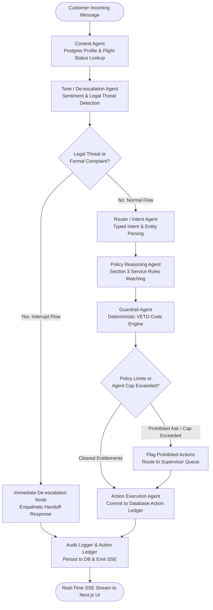

# Resolve — Customer-Facing Airline Disruption Multi-Agent Resolution System
*SkyRoute Disruption Customer Care Platform | AIONOS Agentic AI Factory — Assignment 3*

---

## 1. Project Summary
**Resolve** is a policy-grounded multi-agent customer support platform built for fictional carrier **SkyRoute** to handle critical flight disruptions (flight cancellations, schedule delays, compensation vouchers, voluntary rebooking, and refund requests). Rather than deploying an opaque, single-prompt chatbot that risks hallucinating policy or conceding unentitled claims, Resolve structures reasoning through an inspectable **LangGraph StateGraph** featuring hard, deterministic code guardrails. Every decision strictly adheres to ground-truth airline policy, guaranteeing that customer entitlements (such as meal vouchers, lounge passes, delayed-hours hotel stays, and Gold/Platinum priority access) are executed reliably, while unauthorized demands (such as arbitrary fare difference waivers, cabin upgrades, or legal disputes) are deterministically intercepted and escalated to human supervisors with a tamper-evident audit ledger.

---

## 2. Architecture Diagram



### Node Responsibilities:
- **`Context Agent`**: Deterministically loads active customer profile (tier, PNR, travel history) and flight disruption facts directly from PostgreSQL.
- **`Tone / De-escalation Agent`**: Evaluates sentiment in parallel on every turn; immediately intercepts legal threats or formal complaints to halt automated resolution and initiate human escalation.
- **`Router / Intent Agent`**: Classifies customer intent (`status_check`, `rebook_request`, `compensation_request`, `refund_request`, `escalation_trigger`, `general_query`) and parses typed entities.
- **`Policy Reasoning Agent`**: Matches booking status and delay duration against Section 3 Service Rules to establish valid entitlements and citations.
- **`Guardrail Agent`**: Executes deterministic Python checks with absolute veto authority, blocking policy breaches (e.g., fare waivers > ₹1,500, full-night hotel stays, complimentary upgrades).
- **`Action Execution Agent`**: Commits authorized actions (`voucher_issued`, `lounge_granted`, `hotel_arranged`, `refund_initiated`, `rebooked`) and escalation records to the database.
- **`Audit Logger`**: Appends timestamped events, agent traces, and rule citations to the immutable database audit trail and streams SSE updates.

---

## 3. Agents Built and Responsibilities

| Agent Name | Primary Responsibility | Allowed to Decide (LLM) | Hardcoded / Deterministic Rules (Code) |
|---|---|---|---|
| **Context Agent** | Customer & flight data retrieval | None (pure DB reader) | Loads only ground-truth DB records for active PNR/Customer ID. Zero model hallucination permitted. |
| **Tone / De-escalation Agent** | Sentiment analysis & legal threat interception | Classifies customer sentiment tone (neutral, frustrated, angry) | Deterministic pattern interception for legal threats (`sue`, `lawyer`, `court`, `formal complaint`, `DGCA`). Forces immediate escalation without substantive compromise. |
| **Router / Intent Agent** | Intent classification & entity parsing | Extracts intent category and identifies requested items (rebook, refund, upgrade, hotel duration, fare difference) | Fallback schema validation and entity extraction guarantees structured JSON. |
| **Policy Reasoning Agent** | Ground-truth entitlement matching | Formulates customer-facing explanatory phrasing | Strictly bounded by Section 3 Service Rules: cancellation options, delay thresholds (<3h, 3-5h, >5h), and tier priority rebooking. |
| **Guardrail Agent** | **VETO Engine & Authority Enforcement** | **None** — strictly deterministic code | **Hard Veto Rules**: (1) Fare difference waiver capped at ₹1,500 max; (2) Hotel accommodation restricted to delayed hours only; (3) Complimentary upgrades prohibited; (4) Refunds restricted to original payment method. |
| **Action Execution Agent** | Committing actions to database | None (pure DB writer) | Only executes actions explicitly approved by the Guardrail Agent. Writes typed rows to `action_ledger`. |
| **Audit Logger** | Trace persistence & real-time streaming | Formats conversational response | Records full conversation audits, timestamps, and broadcasts Server-Sent Events (SSE) to the frontend. |

---

## 4. Data & Assumptions

### Ground Truth Data
All customer profiles, booking statuses, and service rules are strictly seeded from Section 3 of the assignment specification:
- **Priya Nair** (Gold, `SK4821X`): Flight `SK-204` (Delhi → Goa) Cancelled due to operational reasons; Return flight Unaffected.
- **Arvind Kulkarni** (Silver, `TR1190B`): Flight `SK-118` (Mumbai → Bengaluru) Delayed 4 hours (07:10 → 11:10).
- **Meher Kaur** (Platinum, `WL7742`): Flight `SK-305` (Delhi → Hyderabad) Delayed 6 hours (14:00 → 20:00).

### Explicit Assumptions
1. **Rebooking Window (24 Hours)**: Free rebooking for airline-caused cancellation is valid on available flights within 24 hours of the original scheduled departure time (23 Sep 18:40 to 24 Sep 18:40).
2. **Delayed-Hours Hotel vs Full Night**: Delays > 5 hours entitle the passenger to airport day-room / delayed-hours accommodation covering the waiting interval before the revised departure, not an overnight 24-hour hotel stay.
3. **Loyalty Priority Rebooking**: Gold and Platinum tiers receive priority queue placement for next-available seats on rebooked flights, but cannot receive complimentary class upgrades as compensation.
4. **Anger & Legal Threat Interception**: Anger/frustration prompts empathetic language; threats of legal action or filing formal regulatory/court complaints trigger immediate escalation (per Sample C in data pack) without substantive settlement.
5. **Partial Escalation Handling**: When a customer request contains both valid entitlements (e.g. meal voucher + delayed-hours hotel) and an unauthorized ask (e.g. ₹2,000 fare waiver), the system clears and commits the valid actions while cleanly escalating only the unauthorized portion to a supervisor.

---

## 5. AI Tools Used
In compliance with the assignment disclosure requirements:
- **Google Antigravity**: Agentic coding assistant used for full-stack scaffolding, LangGraph pipeline design, and test suite synthesis.
- **Google Gemini (gemini-2.5-flash / gemini-2.0-flash via `langchain-google-genai`)**: Used for structured intent routing, tone classification, and customer-facing response formulation.
- **Python / Pytest**: Automated verification suite validating scenarios 1, 2, and 3 along with deterministic guardrails.

---

## 6. Setup & Run Instructions

### Option A: One-Command Docker Run (Primary Method)

Ensure Docker Desktop is running on your machine.

1. **Clone the repository and enter the directory**:
   ```bash
   cd AIONOS
   ```

2. **Configure environment variables**:
   ```bash
   cp .env.example .env
   ```
   Add your Gemini API key:
   ```env
   GOOGLE_API_KEY=your_gemini_api_key_here
   ```
   *(Note: Resolve includes an offline deterministic mode; if no key is provided, set `MOCK_LLM=true` in `.env` to run the entire application and test suite without an API key).*

3. **Launch with Docker Compose**:
   ```bash
   docker-compose up --build
   ```
   This automatically:
   - Starts PostgreSQL 15 on port `5432` with a database healthcheck.
   - Starts the FastAPI backend on port `8000` and automatically runs the idempotent database seed script.
   - Starts the Next.js 14 frontend console on port `3000`.

4. **Open the application**:
   Open **[http://localhost:3000](http://localhost:3000)** in your browser.

---

### Option B: Manual Local Setup (Secondary Method)

#### 1. Backend Setup:
```bash
cd backend
python -m venv .venv

# On Windows:
.venv\Scripts\activate
# On Linux/macOS:
# source .venv/bin/activate

pip install -r requirements.txt
python -m app.db.seed
uvicorn app.main:app --reload --port 8000
```

#### 2. Frontend Setup:
```bash
cd frontend
npm install
npm run dev
```
Open **[http://localhost:3000](http://localhost:3000)**.

---

## 7. How to Test the Three Required Scenarios

The frontend includes 1-click test scenario buttons directly in the chat window for instant reviewer verification. Alternatively, run the automated test suite or enter prompts manually:

### Automated PyTest Suite
Run the comprehensive test suite with:
```bash
pytest backend/tests -v
```
All 5 tests pass end-to-end:
- `test_scenario_priya.py`: Asserts cancellation rebook/refund options, Gold priority, upgrade decline, and supervisor escalation.
- `test_scenario_arvind.py`: Asserts 4h delay bucket (>3h) meal voucher + lounge granted, hotel declined with rule citation, zero escalation.
- `test_scenario_meher.py`: Asserts 6h delay bucket (>5h) meal voucher + delayed-hours hotel granted (not full night), ₹2,000 waiver escalated.
- `test_guardrails.py`: Asserts immediate de-escalation on legal threats (Sample C) and agent trace completeness.

---

### Interactive Manual Testing Steps

#### Scenario 1: Priya Nair (Gold, PNR: SK4821X)
1. In the UI, click **Priya Nair** (or navigate to `/chat/1`).
2. Click the quick prompt button:
   > *"My flight SK-204 from Delhi to Goa was cancelled. What are my options?"*
   - **Expected**: Agent informs her flight SK-204 was cancelled for operational reasons. Offers free rebooking within 24 hours OR full refund within 7 business days to original payment method. Mentions Gold priority rebooking.
3. Click the follow-up prompt:
   > *"I am furious! I want a full cash refund plus a free upgrade to business class on my return flight for the trouble."*
   - **Expected**: Agent politely explains that Gold status provides priority rebooking only, and complimentary upgrades exceed agent authority. The upgrade demand is **escalated to a human supervisor** with an unmissable red Escalation Banner.

#### Scenario 2: Arvind Kulkarni (Silver, PNR: TR1190B)
1. Switch to **Arvind Kulkarni** (or navigate to `/chat/2`).
2. Click the quick prompt button:
   > *"My flight SK-118 is delayed 4 hours. I am frustrated about missing my meeting. Can you arrange hotel accommodation since it has been such a long delay?"*
   - **Expected**: Agent recognizes 4h delay (> 3 hours). Issues a meal voucher and complimentary lounge access. Explains that under SkyRoute policy, hotel accommodation requires delays exceeding 5 hours, so hotel is declined with the rule cited. **No escalation needed** (Arvind is politely informed).

#### Scenario 3: Meher Kaur (Platinum, PNR: WL7742)
1. Switch to **Meher Kaur** (or navigate to `/chat/3`).
2. Click the quick prompt button:
   > *"My flight SK-305 is delayed 6 hours. I want a full night's hotel stay rather than just waiting at the airport, and I want to be moved onto a different, higher-fare flight instead with a ₹2,000 fare difference."*
   - **Expected**:
     - >5h delay bucket qualifies for meal voucher + hotel accommodation for **delayed hours only** (explicitly states policy does not cover full night).
     - Moving to higher-fare flight has a ₹2,000 difference, which exceeds the ₹1,500 agent waiver cap.
     - Agent executes the meal voucher and delayed-hours room, while **escalating the ₹2,000 fare waiver** to a supervisor.

#### Bonus: Legal Threat / Formal Complaint (Sample C)
Click the **"Test Legal Threat / Formal Complaint Trigger"** button:
> *"This is unacceptable, I'm going to file a formal complaint and consider legal action over this."*
- **Expected**: The Tone Agent immediately triggers a hard stop. Normal processing is interrupted. An empathetic response is provided, and the case is escalated without attempting substantive settlement.

---

## 8. Known Limitations
1. **Free-Tier Gemini Quotas**: When running with live Gemini free-tier API keys, rapid repetitive requests in quick succession may hit provider rate limits. Resolve includes structured deterministic fallbacks so evaluation never breaks.
2. **Tone Detection Scope**: Sentiment and legal threat detection combines pattern matching with LLM analysis rather than a dedicated fine-tuned sentiment model.
3. **Fixed Flight Schedule**: The mock environment models the active disruption flights specified in Section 3; additional random flight numbers outside the data pack are not simulated.

---

## 9. Project Structure Overview

```
AIONOS/
├── backend/
│   ├── app/
│   │   ├── main.py                    # FastAPI application, CORS, lifespan database seed
│   │   ├── core/
│   │   │   ├── config.py              # Settings via pydantic-settings
│   │   │   └── llm.py                 # Gemini client with structured output binding
│   │   ├── models/
│   │   │   ├── models.py              # SQLAlchemy ORM models: Customer, Booking, Action, Audit
│   │   │   └── schemas.py             # Pydantic schemas for data serialization and agent I/O
│   │   ├── db/
│   │   │   ├── session.py             # SQLAlchemy session maker (PostgreSQL & SQLite)
│   │   │   └── seed.py                # Idempotent ground-truth seed script
│   │   ├── agents/
│   │   │   ├── context_agent.py       # Customer profile & booking reader
│   │   │   ├── tone_agent.py          # Tone analysis & legal threat detector
│   │   │   ├── router_agent.py        # Intent classifier & entity parser
│   │   │   ├── policy_agent.py        # Service rules entitlement evaluator
│   │   │   ├── guardrail_agent.py     # Deterministic VETO engine
│   │   │   ├── execution_agent.py     # Database action ledger writer
│   │   │   ├── audit_logger.py        # Trace recording & customer response synthesizer
│   │   │   └── graph.py               # LangGraph StateGraph orchestration
│   │   └── api/
│   │       ├── routes_chat.py         # SSE streaming & REST chat endpoints
│   │       └── routes_admin.py        # Customer, booking, and action ledger endpoints
│   ├── tests/
│   │   ├── conftest.py                # Test fixtures and SQLite DB setup
│   │   ├── test_scenario_priya.py     # Scenario 1 test suite
│   │   ├── test_scenario_arvind.py    # Scenario 2 test suite
│   │   ├── test_scenario_meher.py     # Scenario 3 test suite
│   │   └── test_guardrails.py         # Guardrail edge cases & Sample C test suite
│   ├── requirements.txt
│   └── Dockerfile
│
├── frontend/
│   ├── app/
│   │   ├── layout.tsx                 # Root layout with dark mode and fonts
│   │   ├── page.tsx                   # Customer picker & scenario launchpad
│   │   ├── globals.css                # Tailwind CSS styling and custom scrollbars
│   │   └── chat/
│   │       └── [customerId]/
│   │           └── page.tsx           # Three-pane support console
│   ├── components/
│   │   ├── Header.tsx                 # Top navigation and passenger switcher
│   │   ├── BookingSidebar.tsx         # Passenger context, loyalty tier, and bookings
│   │   ├── ChatWindow.tsx             # Interactive conversation with scenario shortcuts
│   │   ├── AgentTracePanel.tsx        # Live visual pipeline of agent reasoning
│   │   ├── ActionLedger.tsx           # Persisted action ledger with timestamps and rules
│   │   └── EscalationBanner.tsx       # Distinct alert banner for human handoffs
│   ├── lib/
│   │   ├── api.ts                     # SSE stream consumer and API client
│   │   ├── types.ts                   # TypeScript interfaces
│   │   └── utils.ts                   # Tailwind utility helpers
│   ├── package.json
│   ├── tsconfig.json
│   ├── tailwind.config.ts
│   └── Dockerfile
│
├── docker-compose.yml                 # Multi-container orchestration (Postgres, Backend, Frontend)
├── .env.example                       # Committed environment variable template
├── .gitignore                         # Excludes .env, virtual environments, and node_modules
└── README.md                          # Comprehensive system documentation
```
