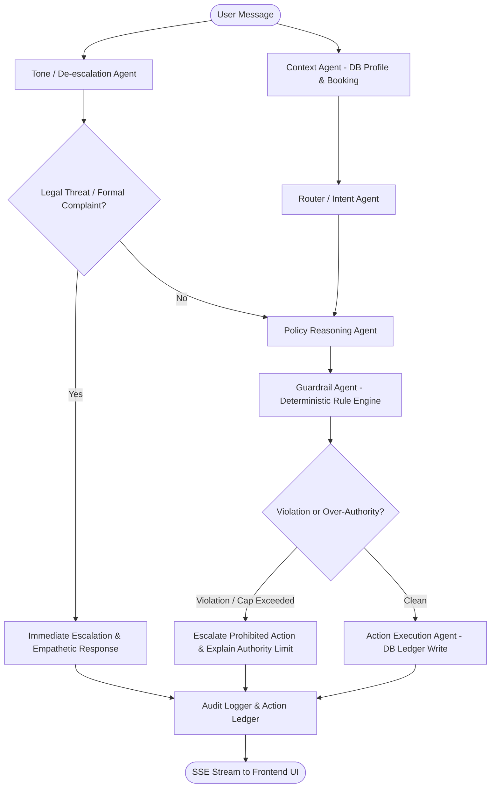

# Implementation Plan: 'Resolve' — Customer-Facing Multi-Agent Airline Disruption Resolution System

Build "Resolve" — a production-grade multi-agent customer support system for fictional carrier "SkyRoute", handling flight disruptions (cancellations, delays, rebooking, refunds, compensation) strictly grounded in the provided ground-truth data pack, with hard deterministic guardrails that enforce human escalation when agent authority is exceeded.

## User Review Required

> [!IMPORTANT]
> **LLM API Configuration:** The backend will use `langchain-google-genai` with Google Gemini (`gemini-2.5-flash` or `gemini-2.0-flash`). Please ensure a valid `GOOGLE_API_KEY` is placed in `.env` (a template `.env.example` will be provided). A mock/test mode fallback will also be provided so the entire test suite and frontend can run seamlessly even in offline/demo environments without API failures.

> [!NOTE]
> **Database Dual-Support:** For `docker-compose up`, PostgreSQL 15 is used with automated idempotent database seeding on startup. For fast local unit tests (`pytest`), the database adapter automatically supports both SQLite and PostgreSQL via the `DATABASE_URL` environment variable.

---

## Architecture & Agent Pipeline

The core grading criterion is an **inspectable, multi-agent state graph** in LangGraph (not a single prompt).



### Agents & Responsibilities

| Agent Name | Type | Responsibility | Deterministic vs LLM |
|---|---|---|---|
| **Context Agent** | DB Reader | Fetches customer profile (tier, history) and booking details (status, delay, route) from Postgres | 100% Deterministic (SQL query) |
| **Router / Intent Agent** | LLM (Structured) | Classifies intent (`status_check`, `rebook_request`, `compensation_request`, `refund_request`, `escalation_trigger`, `general_query`) & extracts entities | LLM with JSON schema / function calling |
| **Tone / De-escalation Agent** | Hybrid | Analyzes sentiment, detects aggression/frustration, flags legal threats or formal complaints | Hybrid (pattern detection + LLM sentiment classification). Legal threats trigger immediate escalation |
| **Policy Reasoning Agent** | LLM + Policy Lookup | Matches booking state to Section 3 Service Rules; determines entitled benefits & rules cited | Structured LLM grounded in structured policy objects |
| **Guardrail Agent** | **Deterministic Code** | Has **VETO power**. Validates proposed actions against strict policy caps: fare waiver cap (₹1,500), delayed-hours hotel only, airline-caused refund only, payment method check. | **100% Deterministic Code** — cannot be bypassed by LLM |
| **Action Execution Agent** | DB Writer | Writes approved actions (`rebooked`, `voucher_issued`, `lounge_granted`, `hotel_arranged`, `refund_initiated`) to the `action_ledger` table | 100% Deterministic (SQL write) |
| **Audit Logger** | Persistence / SSE | Logs every intermediate decision, rule cited, timestamp, and emits real-time SSE events | 100% Deterministic |

---

## Proposed Changes

### 1. Project Directory Structure

```
AIONOS/
├── backend/
│   ├── app/
│   │   ├── __init__.py
│   │   ├── main.py                    # FastAPI application, CORS, startup events
│   │   ├── core/
│   │   │   ├── __init__.py
│   │   │   ├── config.py              # Pydantic Settings (.env configuration)
│   │   │   └── llm.py                 # Gemini client initialization with structured output
│   │   ├── models/
│   │   │   ├── __init__.py
│   │   │   ├── models.py              # SQLAlchemy ORM: Customer, Booking, Policy, Action, Audit
│   │   │   └── schemas.py             # Pydantic validation & SSE payload schemas
│   │   ├── db/
│   │   │   ├── __init__.py
│   │   │   ├── session.py             # Database engine & session maker
│   │   │   └── seed.py                # Idempotent seed script with exact Section 3 data
│   │   ├── agents/
│   │   │   ├── __init__.py
│   │   │   ├── context_agent.py       # Customer & booking lookup
│   │   │   ├── router_agent.py        # Intent classification & entity parsing
│   │   │   ├── tone_agent.py          # Tone analysis & legal threat detection
│   │   │   ├── policy_agent.py        # Entitlement reasoning & rule citation
│   │   │   ├── guardrail_agent.py     # Deterministic code-based veto engine
│   │   │   ├── execution_agent.py     # Action ledger committer
│   │   │   ├── audit_logger.py        # Event recording & SSE dispatcher
│   │   │   └── graph.py               # LangGraph StateGraph orchestration
│   │   └── api/
│   │       ├── __init__.py
│   │       ├── routes_chat.py         # SSE streaming chat endpoint
│   │       └── routes_admin.py        # Customer, booking, and action ledger endpoints
│   ├── tests/
│   │   ├── conftest.py                # Test fixtures, DB setup
│   │   ├── test_scenario_priya.py     # Priya Nair test suite
│   │   ├── test_scenario_arvind.py    # Arvind Kulkarni test suite
│   │   ├── test_scenario_meher.py     # Meher Kaur test suite
│   │   └── test_guardrails.py         # Unit tests for guardrail edge cases & legal threats
│   ├── requirements.txt
│   └── Dockerfile
│
├── frontend/
│   ├── app/
│   │   ├── layout.tsx                 # Root layout with fonts, header, metadata
│   │   ├── page.tsx                   # Customer selector landing screen + quick launch
│   │   ├── chat/
│   │   │   └── [customerId]/
│   │   │       └── page.tsx           # Main 3-pane support console
│   ├── components/
│   │   ├── BookingSidebar.tsx         # Left pane: Customer loyalty tier, booking details, travel history
│   │   ├── ChatWindow.tsx             # Center pane: Live chat, quick prompt helpers, message history
│   │   ├── AgentTracePanel.tsx        # Right pane (top): Visual live stream of agent pipeline steps
│   │   ├── ActionLedger.tsx           # Right pane (bottom): Real-time persisted action ledger with rule citations
│   │   ├── EscalationBanner.tsx       # Distinct alert banner for human handoff with reason
│   │   └── Header.tsx                 # Customer switcher, status indicators, theme toggle
│   ├── lib/
│   │   ├── api.ts                     # API client & SSE consumer
│   │   ├── types.ts                   # TypeScript interfaces matching backend models
│   │   └── utils.ts                   # Tailwind utility helpers
│   ├── package.json
│   ├── tsconfig.json
│   ├── tailwind.config.ts
│   └── Dockerfile
│
├── docker-compose.yml
├── .env.example
├── .gitignore
└── README.md
```

---

## Step-by-Step Implementation Details

### Component: Database & Seeding (`backend/app/db`)
- Seed exactly the 3 customers and flights per Section 3:
  - **Priya Nair** (Gold, `SK4821X`): Flight `SK-204` (Delhi → Goa, 23 Sep 18:40, Cancelled - operational reasons); Return flight (Goa → Delhi, 25 Sep 16:20, Unaffected). History: 6 flights/12mo, 1 baggage voucher.
  - **Arvind Kulkarni** (Silver, `TR1190B`): Flight `SK-118` (Mumbai → Bengaluru, 23 Sep 07:10, Delayed 4h, new dep 11:10). History: 3 flights/12mo.
  - **Meher Kaur** (Platinum, `WL7742`): Flight `SK-305` (Delhi → Hyderabad, 23 Sep 14:00, Delayed 6h, new dep 20:00). History: 10 flights/12mo, 1 tier-upgrade resolution.
- Store structured policy rules in `policies` table for structured queries and citations.

### Component: Agent Pipeline (`backend/app/agents`)
- Build the LangGraph `StateGraph` with explicit typed state `AgentState`:
  - `customer_id`, `pnr`, `user_message`, `conversation_history`
  - `customer_profile`, `active_booking`
  - `intent`, `extracted_entities`
  - `tone_sentiment`, `legal_threat_detected`, `frustration_score`
  - `policy_entitlements`, `rules_cited`
  - `guardrail_status` (`PASSED`, `ESCALATED`, `PARTIAL_ESCALATION`), `guardrail_violations`
  - `executed_actions` (written to DB)
  - `final_response_text`, `trace_events`
- Guardrail Agent includes hardcoded deterministic checks:
  1. `fare_waiver > 1500` -> Prohibited, Escalate.
  2. `hotel_duration == 'full_night'` when delay > 5h -> Prohibited (only delayed-hours hotel allowed).
  3. `compensation_beyond_policy` (e.g., cash refund + free upgrade combination) -> Prohibited, Escalate.
  4. `legal_threat == True` or `formal_complaint == True` -> Prohibited from resolution, Escalate immediately.
  5. `refund_different_payment_method` -> Prohibited, Escalate.

### Component: FastAPI Endpoints & Streaming SSE (`backend/app/api`)
- `POST /api/chat/stream`: Emits SSE messages for each node transition:
  - `event: trace` with `{ agent: "Context Agent", status: "Loaded Gold customer Priya Nair + cancelled flight SK-204" }`
  - `event: trace` with `{ agent: "Policy Reasoning Agent", rule: "Cancellation Rebooking Rule", entitlement: "Free rebooking within 24h OR full refund" }`
  - `event: trace` with `{ agent: "Guardrail Agent", status: "VIOLATION", detail: "Fare waiver ₹2,000 exceeds ₹1,500 limit → ESCALATING" }`
  - `event: action` with `{ type: "voucher_issued", details: "₹500 Meal Voucher + Lounge Access" }`
  - `event: message` with the final response chunk/text
  - `event: done`

### Component: Frontend UI (`frontend/`)
- Next.js 14 App Router with TailwindCSS.
- High-grade SaaS support console design:
  - **Dark/Light slate enterprise aesthetic** with crisp borders, status badges, and glowing live indicators.
  - **Left Sidebar**: Customer card with Loyalty tier badge (Gold/Silver/Platinum), travel history, active booking with delay/cancellation status badge.
  - **Center Console**: Smooth chat thread with message timestamps, quick scenario prompt buttons (`Scenario 1: Priya`, `Scenario 2: Arvind`, `Scenario 3: Meher`), and clear Escalation Banner with alert icons and supervisor handover notices.
  - **Right Sidebar**:
    - **Live Agent Trace**: Step-by-step progress cards showing each agent's execution, badge state (Running, Complete, Warning, Escalated), and intermediate reasoning/rule citation.
    - **Action Ledger**: Real-time table of database-committed actions with rule references and timestamps.

### Component: Test Suite (`backend/tests`)
- `test_scenario_priya.py`:
  - Step 1: Inquire about cancelled flight -> Rebook within 24h or refund offered, Gold priority mentioned.
  - Step 2: Demand cash refund + free business class upgrade -> Refund offered per policy, business class upgrade flagged by Guardrail as exceeding policy -> Escalated.
- `test_scenario_arvind.py`:
  - Delay 4h -> Arvind asks for hotel -> Policy identifies >3h bucket (Meal voucher + lounge); requests hotel -> Guardrail/Policy explains hotel requires >5h delay, declines hotel with rule citation, grants meal voucher + lounge. No escalation needed.
- `test_scenario_meher.py`:
  - Delay 6h -> Meher asks for full night hotel + rebook onto higher-fare flight with ₹2,000 fare difference -> Meal voucher + delayed-hours hotel granted; ₹2,000 waiver exceeds ₹1,500 cap -> Guardrail flags ₹2,000 waiver and triggers escalation for the fare difference while processing qualified benefits.

---

## Verification Plan

### Automated Tests
Run pytest in backend container/environment:
```powershell
pytest backend/tests -v
```
Verifies:
- Customer seed idempotency
- Priya Nair scenario (rebook/refund + upgrade escalation)
- Arvind Kulkarni scenario (4h delay -> voucher + lounge, hotel declined, no escalation)
- Meher Kaur scenario (6h delay -> delayed-hours hotel granted, ₹2,000 waiver escalated)
- Guardrail edge cases (legal threat immediate de-escalation, fare cap ₹1,500)

### Manual Verification via Browser & Docker
1. Start with `docker-compose up --build`.
2. Open `http://localhost:3000` in the browser.
3. Test Customer Switcher: Switch between Priya, Arvind, and Meher.
4. Click the pre-configured Scenario buttons or type conversation prompts.
5. Inspect:
   - Left pane: Real customer data loaded from Postgres.
   - Right pane: Live Agent Trace streaming each node's decision in real-time.
   - Right pane: Action Ledger updating dynamically.
   - Center pane: Escalation banner appearing with exact reason on policy violations.
